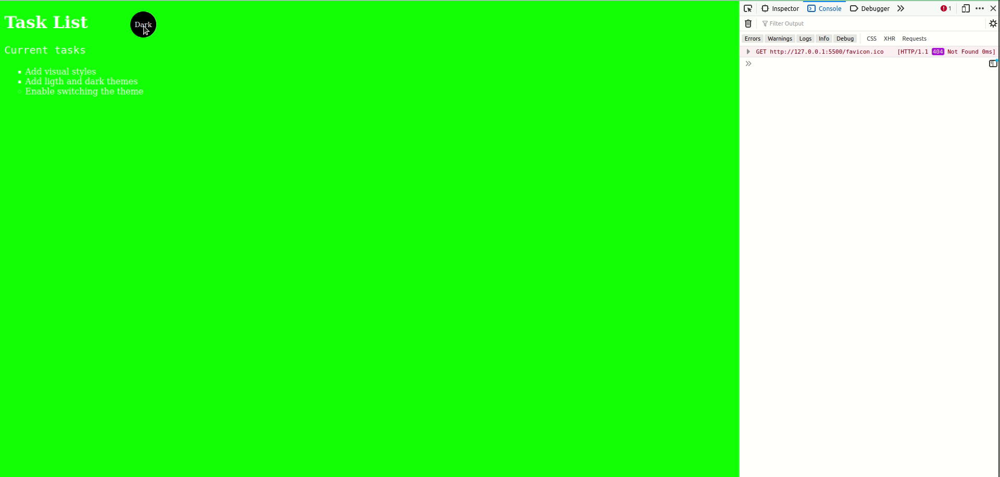

# Curso HTML, CSS e JS - Bradesco

## ✏ Sobre o projeto

Projeto introdutório em HTML, CSS e Js, realizado na plataforma do Bradesco.

Foi ralizado um página simples onde podemos realiza a mudanças do background da pagina, ultilzando o JavaScript.

